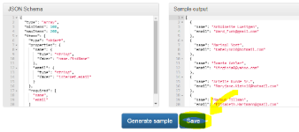

[](https://github.com/json-schema-faker/json-schema-faker)

[](https://travis-ci.org/json-schema-faker/json-schema-faker)
[](http://badge.fury.io/js/json-schema-faker)
[](https://badge.fury.io/bo/json-schema-faker)
[](https://codecov.io/github/json-schema-faker/json-schema-faker?branch=master)

[](https://david-dm.org/json-schema-faker/json-schema-faker)
[](https://david-dm.org/json-schema-faker/json-schema-faker#info=devDependencies)

[](http://inch-ci.org/github/json-schema-faker/json-schema-faker)
[](http://json-schema-faker.github.io/json-schema-faker/)

Use [JSON Schema](http://json-schema.org/) along with fake generators to provide consistent and meaningful fake data for your system.

We are looking for **contributors**! If you wanna help us make `jsf` more awesome, simply write us so!

## NEW in JSON Schema Faker: store schemas online!

[](http://json-schema-faker.js.org/)


# Table of contents

- Basics
  - [JSON-schema-faker](#fake-your-schemas)
  - [Online demo](#online-demo)
  - [Install](#install)
    - [npm](#npm)
    - [bower](#bower)
    - [cdnjs](#cdnjs)
  - [Overview](#overview)
  - [Example usage](#example-usage)
    - [More examples](#more-examples)
    - [Gist demos](#gist-demos)
  - [Automation](#automation)
    - [Angular-jsf (AngularJS plugin)](#angular-jsf)
    - [Grunt plugin](#grunt-plugin)
- Advanced
  - [JSON Schema specification support](#json-schema-specification-support)
  - [Supported keywords](#supported-keywords)
  - [Using references](#using-references)
  - [Faking values](#faking-values)
    - [Advanced usage of faker.js and Chance.js](#user-content-advanced-usage-of-fakerjs-and-chancejs)
  - [Custom formats](#custom-formats)
  - [Custom options](#custom-options)
  - [Extending dependencies](#extending-dependencies)
  - [Inferred Types](#inferred-types)
  - [Swagger extensions](#swagger-extensions)
  - [Bundling](#bundling)
- Misc
  - [Contribution](#contribution)
    - [Technical Documentation](#technical-documentation)
  - [Resources](#resources)
  - [Motivation](#motivation)

## Online demo

See [online demo](http://json-schema-faker.js.org/). You can save your schemas online and share the link with your collaborators.

## Install

`jsf` is installable through 3 different channels:

### npm

Install `json-schema-faker` with npm:

    npm install json-schema-faker --save

### bower

Install `json-schema-faker` with bower:

    bower install json-schema-faker --save

### cdnjs

JSON-Schema-faker is also available at [cdnjs.com](https://www.cdnjs.com/libraries/json-schema-faker). This means you can just include the script file into your HTML:

    # remember to update the version number!
    <script type="text/javascript" src="https://cdnjs.cloudflare.com/ajax/libs/json-schema-faker/0.3.4/json-schema-faker.min.js"></script>

It will be fetched from the [Content Delivery Network](https://en.wikipedia.org/wiki/Content_delivery_network) without installing any node.js package.

You can see [an example JS fiddle based on `jsf` loaded from cdnjs](https://jsfiddle.net/ftzhnmzq/4/).

## Overview

JSON-Schema-faker (or `jsf` for short) combines two things:

 * The [JSON-schema specification](http://json-schema.org/), that defines what is the allowed content of a JSON document
 * Fake data generators, that are used to generate basic or complex data, conforming to the schema. Following libraries come bundled with jsf:
   * [faker.js](https://github.com/Marak/faker.js)
   * [chance.js](https://github.com/victorquinn/chancejs)
   * [randexp](https://github.com/fent/randexp.js)

## Example usage

```javascript
var jsf = require('json-schema-faker');

var schema = {
  type: 'object',
  properties: {
    user: {
      type: 'object',
      properties: {
        id: {
          $ref: '#/definitions/positiveInt'
        },
        name: {
          type: 'string',
          faker: 'name.findName'
        },
        email: {
          type: 'string',
          format: 'email',
          faker: 'internet.email'
        }
      },
      required: ['id', 'name', 'email']
    }
  },
  required: ['user'],
  definitions: {
    positiveInt: {
      type: 'integer',
      minimum: 0,
      exclusiveMinimum: true
    }
  }
};

var sample = jsf(schema);

console.log(sample);
// "[object Object]"

console.log(sample.user.name);
// "John Doe"
```
([demo »](http://json-schema-faker.js.org/#gist/927cf888cbc250a2b8e60eb5834cdfbd))

`jsf.version` attribute is available to check which version you're using:

```javascript
var jsf = require('json-schema-faker');
console.log(jsf.version);
// "0.3.6"
```

### More examples

 * [json-schema.org/example1.html](http://json-schema.org/example1.html):
   [warehouse location](http://json-schema-faker.js.org/#gist/bb4774bf26167360e7c5cf2a29db3e56),
   [Product from Acme catalog](http://json-schema-faker.js.org/#gist/c7a398c537cf7befce0df67fe7feeea8)
 * [json-schema.org/example2.html](http://json-schema.org/example2.html):
   [_diskDevice_ storage type](http://json-schema-faker.js.org/#gist/0c0d676023ea505c97eef9af0b4d95da),
   [_diskUUID_ storage type](http://json-schema-faker.js.org/#gist/0ac23aa547acfdb2897a7afec3042534),
   [_nfs_ storage type](http://json-schema-faker.js.org/#gist/473ac2bc364b2610f7fc703e59cfe1c9),
   [_tmpfs_ storage type](http://json-schema-faker.js.org/#gist/de1c5f18f0d231557ce25e44f581cadf)

### Gist demos

Clone these gists and execute them locally (each gist has its own readme with instructions):

 * [jsf console](https://gist.github.com/ducin/9f2364ccde2e9248fbcd) - minimal example of jsf working directly under command line
 * [jsf grunt](https://gist.github.com/ducin/87e0b55bddd1801d3d99) - example of jsf working under grunt.js

## Automation

### angular-jsf

Use [`angular-jsf`](https://github.com/json-schema-faker/angular-jsf) module (installable via `npm` and `bower`) to get **`jsf` working in your angular app out of the box**! And check out [angular-jsf demo](http://angular-jsf.js.org/).

### Grunt plugin

Use [grunt-jsonschema-faker](https://github.com/json-schema-faker/grunt-jsonschema-faker)
to automate running `json-schema-faker` against your JSON schemas.

## JSON Schema specification support

Currently `jsf` supports the JSON-Schema specification **draft-04** only.

If you want to use **draft-03**, you may find useful information [here](https://github.com/json-schema-faker/json-schema-faker/issues/66).

## Supported keywords

Below is the list of supported keywords:

- `$ref` &mdash; Resolve internal references only, and/or external if provided.
- `required` &mdash; All required properties are guaranteed, if not can be omitted.
- `pattern` &mdash; Generate samples based on RegExp values.
- `format` &mdash; Core formats only:
  [`date-time`](http://json-schema.org/latest/json-schema-validation.html#anchor108),
  [`email`](http://json-schema.org/latest/json-schema-validation.html#anchor111),
  [`hostname`](http://json-schema.org/latest/json-schema-validation.html#anchor114),
  [`ipv4`](http://json-schema.org/latest/json-schema-validation.html#anchor117),
  [`ipv6`](http://json-schema.org/latest/json-schema-validation.html#anchor120)
  and [`uri`](http://json-schema.org/latest/json-schema-validation.html#anchor123)
    -- [demo »](http://json-schema-faker.js.org/#gist/f58db80cbf52c12c623166090240d964)
- `enum` &mdash; Returns any of these enumerated values.
- `minLength`, `maxLength` &mdash; Applies length constraints to string values.
- `minimum`, `maximum` &mdash; Applies constraints to numeric values.
- `exclusiveMinimum`, `exclusiveMaximum` &mdash; Adds exclusivity for numeric values.
- `multipleOf` &mdash; Multiply constraints for numeric values.
- `items` &mdash; Support for subschema and fixed item values.
- `minItems`, `maxItems` &mdash; Adds length constraints for array items.
- `uniqueItems` &mdash; Applies uniqueness constraints for array items.
- `additionalItems` &mdash; Partially supported (?)
- `allOf`, `oneOf`, `anyOf` &mdash; Subschema combinators.
- `properties` &mdash; Object properties to be generated.
- `minProperties`, `maxProperties` &mdash; Adds length constraints for object properties.
- `patternProperties` &mdash; RegExp-based object properties.
- `additionalProperties` &mdash; Partially supported (?)
- `dependencies` &mdash; Not supported yet (?)
- `not` &mdash; Not supported yet (?)

## Using references

Inline references are fully supported (json-pointers) but external can't be resolved by `jsf`.

In order to achieve that you can use [refaker](https://github.com/json-schema-faker/refaker) and then use the resolved schemas:

```javascript
var schema = {
  type: 'object',
  properties: {
    someValue: {
      $ref: 'otherSchema'
    }
  }
};

var refs = [
  {
    id: 'otherSchema',
    type: 'string'
  }
];

var sample = jsf(schema, refs);

console.log(sample.someValue);
// "voluptatem"
```

## Faking values

`jsf` has built-in generators for core-formats, [Faker.js](http://marak.com/faker.js/) and [Chance.js](http://chancejs.com/) are also supported.

You can use **faker** or **chance** properties but they are optional:

```json
{
  "type": "string",
  "faker": "internet.email"
}
```
([demo »](http://json-schema-faker.js.org/#gist/89659ebf28be89d3f860c3f80cbffe4b))

The above schema will invoke [`faker.internet.email()`](https://github.com/Marak/faker.js/blob/1f47f09e25ad43db41ea4187c3cd3f7e113d4cb4/lib/internet.js#L32).

Note that both generators has higher precedence than **format**.

You can also use standard JSON Schema keywords, e.g. `pattern`:

```json
{
  "type": "string",
  "pattern": "yes|no|maybe|i don't know"
}
```
([demo »](http://json-schema-faker.js.org/#gist/8ee282679da5a31cd7edc4cf35f37081))

### Advanced usage of faker.js and Chance.js

In following inline code examples the `faker` and `chance` variables are assumed to be created with, respectively:

```javascript
var faker = require('faker');

var Chance = require('chance'),
  chance = new Chance();
```

Another example of faking values is passing arguments to the generator:

```json
{
  "type": "string",
  "chance": {
    "email": {
      "domain": "fake.com"
    }
  }
}
```
([demo »](http://json-schema-faker.js.org/#gist/c6ab6a0325e53fd3b38ee0293a9aeea3))

which will invoke [`chance.email({ "domain": "fake.com" })`](https://github.com/chancejs/chancejs/blob/b4c143bf53f516dfd77a8376d0f631462458c062/chance.js#L1118).
This example works for single-parameter generator function.

However, if you pass multiple arguments to the generator function, just pass them wrapped in an array.
In the example below we use the [`faker.finance.amount(min, max, dec, symbol)`](https://github.com/Marak/faker.js/blob/1f47f09e25ad43db41ea4187c3cd3f7e113d4cb4/lib/finance.js#L85)
generator which has 4 parameters. We just wrap them with an array and it's equivalent to `faker.finance.amount(100, 10000, 2, "$")`:

```json
{
  "type": "object",
  "properties": {
    "cash": {
      "type": "string",
      "faker": {
        "finance.amount": [100, 10000, 2, "$"]
      }
    }
  },
  "required": [
    "cash"
  ]
}
```
([demo »](http://json-schema-faker.js.org/#gist/3a15a11d706e5b145c30f943d55c42b2))

However, if you want to pass a single parameter that is an array itself, e.g.
[`chance.pickone(["banana", "apple", "orange"])`](https://github.com/chancejs/chancejs/blob/b4c143bf53f516dfd77a8376d0f631462458c062/chance.js#L382),
just like [described here](https://github.com/json-schema-faker/json-schema-faker/issues/171),
then you need to wrap it with an array once more (twice in total). The outer brackets determine that the content is gonna be a list of params injected into the generator. The inner brackets are just the value itself - the array we pass:

```json
{
  "type": "object",
  "properties": {
    "food": {
      "type": "string",
      "chance": {
        "pickone": [
          [
            "banana",
            "apple",
            "orange"
          ]
        ]
      }
    }
  },
  "required": [
    "food"
  ]
}
```
([demo »](http://json-schema-faker.js.org/#gist/792d626e7d92841ded5be59b8ed001eb))

**BREAKING CHANGES**

> Since `0.3.0` the `faker` and `chance` dependencies aren't shipped by default,
> in order to use both generators you MUST install them with `npm install faker chance --save`.

## Custom formats

Additionally, you can add custom generators for those:

```javascript
jsf.format('semver', function(gen, schema) {
  return gen.randexp('^\\d\\.\\d\\.\\d{1,2}$');
});
```

Now that format can be generated:

```json
{
  "type": "string",
  "format": "semver"
}
```

Usage:

- **format()** &mdash; Return all registered formats (custom only)
- **format(obj)** &mdash; Register formats by key/value &rarr; name/callback
- **format(name)** &mdash; Returns that format generator (undefined if not exists)
- **format(name, callback)** &mdash; Register a custom format by name/callback

Callback:

- **gen** (object) &mdash; Built in generators
  - **faker** (object) &mdash; Faker.js instance
  - **chance** (object) &mdash; Chance.js instance
  - **randexp** (function) &mdash; Randexp generator
- **schema** (object) &mdash; The schema for input

Note that custom generators has lower precedence than core ones.

## Custom Options

You may define following options for `jsf` that alter its behavior:

- `failOnInvalidTypes`: boolean - don't throw exception when invalid type passed
- `defaultInvalidTypeProduct`: - default value generated for a schema with invalid type (works only if `failOnInvalidTypes` is set to `false`)

Set options just as below:

```javascript
jsf.option({
  failOnInvalidTypes: false
});
```

## Extending dependencies

You may extend [Faker.js](http://marak.com/faker.js/):

```javascript
var jsf = require('json-schema-faker');

jsf.extend('faker', function(faker){
  faker.locale = "de"; // or any other language
  faker.custom = {
    statement: function(length) {
      return faker.name.firstName() + " has " + faker.finance.amount() + " on " + faker.finance.account(length) + ".";
    }
  };
  return faker;
});

var schema = {
  "type": "string",
  "faker": {
    "custom.statement": [19]
  }
}

var sample = jsf(schema);
```

or if you want to use [faker's *individual localization packages*](https://github.com/Marak/faker.js#individual-localization-packages), simply do the following:

```js
jsf.extend('faker', function() {
  // just ignore the passed faker instance
  var faker = require('faker/locale/de');
  // do other stuff
  return faker;
});
```

You can also extend [Chance.js](http://chancejs.com/), using built-in [chance.mixin](http://chancejs.com/#mixin) function:

```javascript
var jsf = require('json-schema-faker');

jsf.extend('chance', function(chance){
  chance.mixin({
    'user': function() {
      return {
        first: chance.first(),
        last: chance.last(),
        email: chance.email()
      };
    }
  });

  return chance;
});

var schema = {
  "type": "string",
  "chance": "user"
}

var sample = jsf(schema);
```

The first parameter of `extend` function is the generator name (`faker` or `chance`). The second one is the function that accepts the dependency library; the function alters the library and **returns it**.

## Inferred Types

JSON Schema does not require you to provide the `type` property for your JSON Schema documents and document fragments.

But since `jsf` uses the `type` property to create the proper fake data, we attempt to infer the type whenever it is not provided. We do this based on the JSON Schema validation properties you use.

> Now this means that if you do not use any of the JSON Schema validation properties, jsf will not be able to infer the type for you and you will need to **explicitly** set your `type` manually.)

Below is the list of JSON Schema validation properties and the inferred type based on the property:

**array**

* `additionalItems`
* `items`
* `maxItems`
* `minItems`
* `uniqueItems`

**integer** *(Number uses the same properties so if you need `number`, set your `type` explicitly)*

* `exclusiveMaximum`
* `exclusiveMinimum`
* `maximum`
* `minimum`
* `multipleOf`

**object**

* `additionalProperties`
* `dependencies`
* `maxProperties`
* `minProperties`
* `patternProperties`
* `properties`
* `required`

**string**

* `maxLength`
* `minLength`
* `pattern`

## Swagger extensions

`jsf` supports [OpenAPI Specification *vendor extensions*](https://github.com/OAI/OpenAPI-Specification/blob/master/versions/2.0.md#vendorExtensions), i.e.

* `x-faker` property that stands for `faker` property ([demo »](http://json-schema-faker.js.org/#gist/7cdf200c27eceb6163a79fbc50813fcb))
* `x-chance` property that stands for `chance` property ([demo »](http://json-schema-faker.js.org/#gist/c0084695b4ca1c4cd015ded1f5c6dc33))

Thanks to it, you can use valid swagger definitions for `jsf` data generation.

## Bundling

JSON-Schema-faker might be used in Node.js as well as in the browser. In order to execute `jsf` in a browser, you should include the distribution file from [`dist`](dist) directory. Each new version of `jsf` is bundled using [browserify](http://browserify.org/) and stored by the library maintainers. The bundle includes full versions of all dependencies.

However, you may want to bundle a smaller package of `jsf`, because:
* you want to reduce the bundle file size
* you don't need all languages from faker.js
* you wish to use chance.js only and get rid of other dependencies
* or for any other reason...
In that case you may bundle the distribution yourself manually. It's easily achievable: just modify the [`lib/util/container.js`](lib/util/container.js) file and either remove o rmodify the `require` calls (they're directly used by browserify to include dependencies). Automation of this feature is expected in near future.

## Contribution

* [Alvaro Cabrera](https://twitter.com/pateketrueke)
* [Tomasz Ducin](https://twitter.com/tomasz_ducin)
* artwork by [Ajay Karat](http://www.devilsgarage.com/)

We are more than happy to welcome new contributors, our project is heavily developed, but we need more power :)
Please see [contribution guide](.github/CONTRIBUTING.md), you can always contact us to ask how you can help.

### Technical Documentation

If you want to contribute, take a look at [the technical documentation page](docs/). You may find some important information there making it easier to start.

Moreover, if you find something unclear (e.g. how does something work) or would like to suggest improving the docs, please submit an issue, we'll gladly provide more info for future contributors.

## Resources

* [JSON, JSON Schema & JSON-schema-faker](https://www.youtube.com/watch?v=TkqiUG3j_Xw) - WarsawJS meetup presentation recording, a step-by-step guide to JSON-related tools, including `jsf`

## Motivation

There were some existing projects or services trying to achieve similar goals as `jsf`:

- http://www.json-generator.com/
- https://github.com/unindented/fake-json
- https://github.com/jonahkagan/schematic-ipsum
- https://www.npmjs.org/package/json-schema-mock
- https://github.com/thaume/json-schema-processor
- https://github.com/andreineculau/json-schema-random
- https://github.com/murgatroid99/json-schema-random-instance
- https://github.com/tomarad/JSON-Schema-Instantiator

but they were either incomplete, outdated, broken or non-standard. That's why `jsf` was created.

[](https://bitdeli.com/free "Bitdeli Badge")
