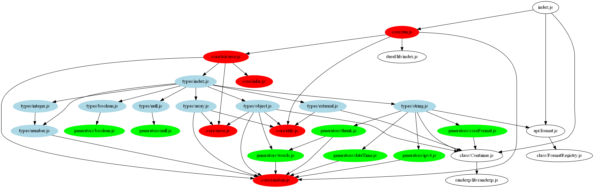

## Table of Contents

* [Architecture](#architecture)
* [Sources](#sources)
* [Building](#building)
* [Testing](#testing)

# Architecture

JSON Schema Faker is a JavaScript tool that can be executed both in the browser and the server.

JSF has been migrated to [TypeScript](typescriptlang.org). The structure is still being refactored.

Currently JSF consists of:

* `types` - each module represents one basic JSON Schema structure
  * there is also the `external` module which executes `chance` and `faker` generators
* `generators` - very small modules which generate some low-level stuff
* `core` - the engine, various files
* `api` - here are additional methods you can call on jsf object:
  * `format()` - to register/get/call your own formats
  * `extend()` - extending jsf dependencies with user custom logic
* `class` - encapsulated containers; you might consider them as part of core
  * `format` - for custom regular expressions
  * `container` - for dependencies (`faker`, `chance`, `randexp`); this is needed for two reasons:
    * end user might want to extend `faker` or `chance` with his/her custom generator functions and we need to remember that
    * we don't want to include both faker and chance by default - we wanna make them optional

# Sources

Currently we've got both:

* new TypeScript source files (`ts` directory)
* old JavaScript output (`lib` directory).

This is a temporary state, of course, it will be refactored :).
Once we find a suitable solution for bundling TypeScript directly into final js build files - we might remove `lib` directory then.
TypeScript is fired with ``--module commonjs` option - javascript output uses standard CommonJS `require` calls and then
it's processed via browserify to create bundles (as it used to before introducing TypeScript).

The codebase is quite complex and so the whole process had to be cplit into parts. THe migration/refactoring is still a work-in-progress.

# Building

Compile typescript to javascript:

    npm run tsc

Build package files:

    ./build/dist.js

# Testing

Detailed description of test [can be found here](../spec).
